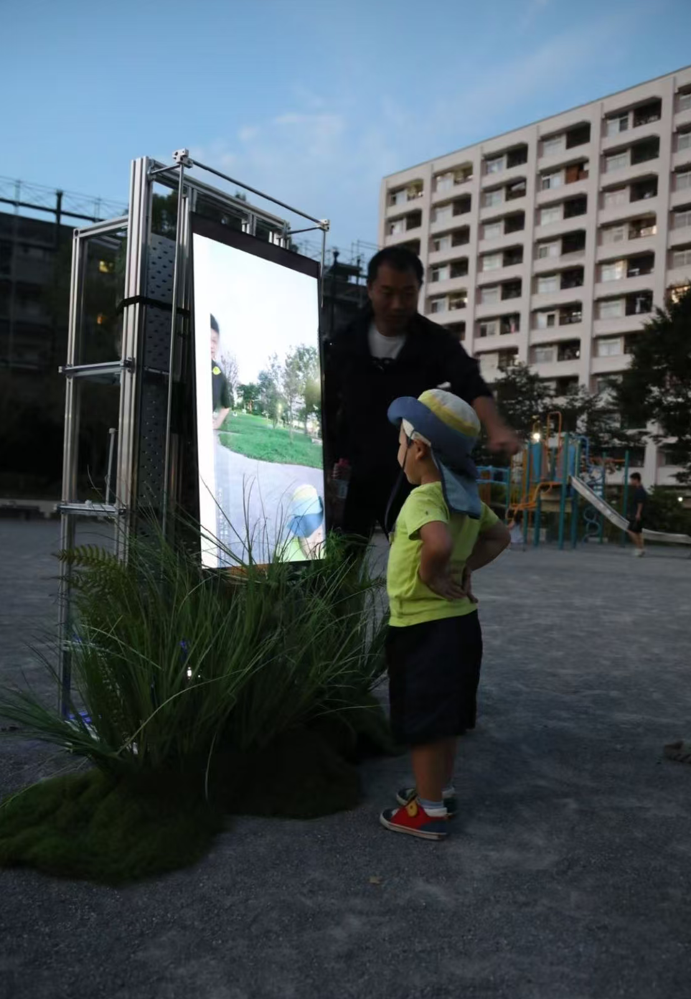
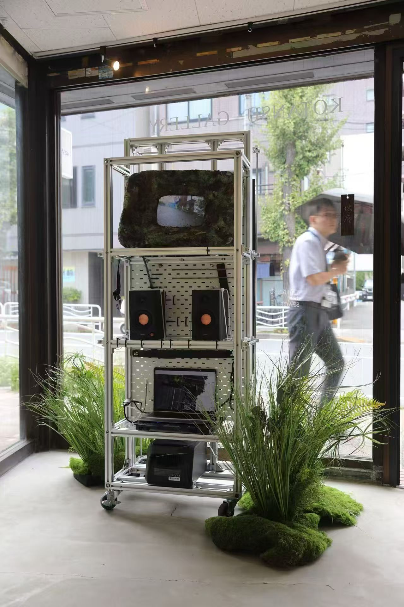
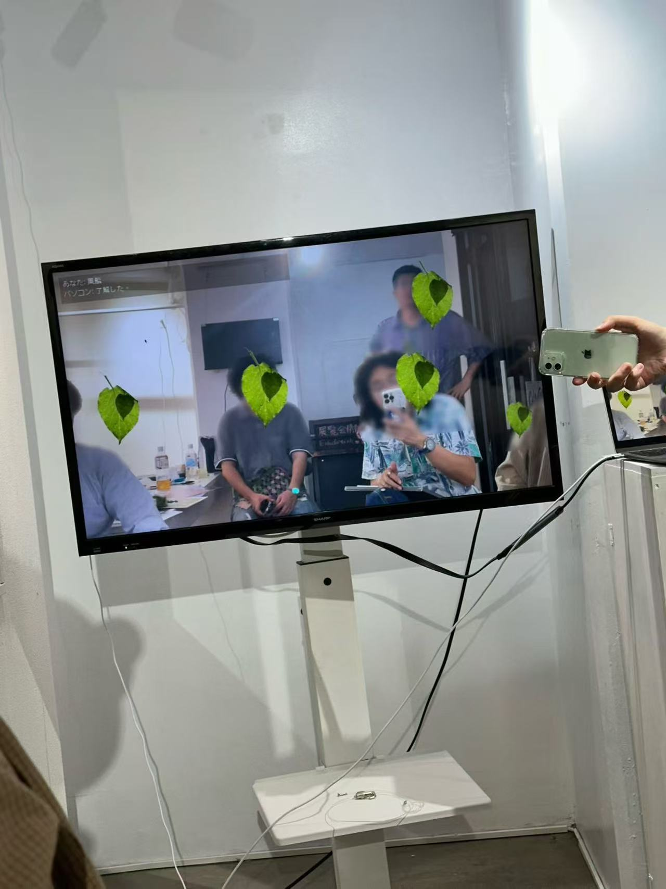
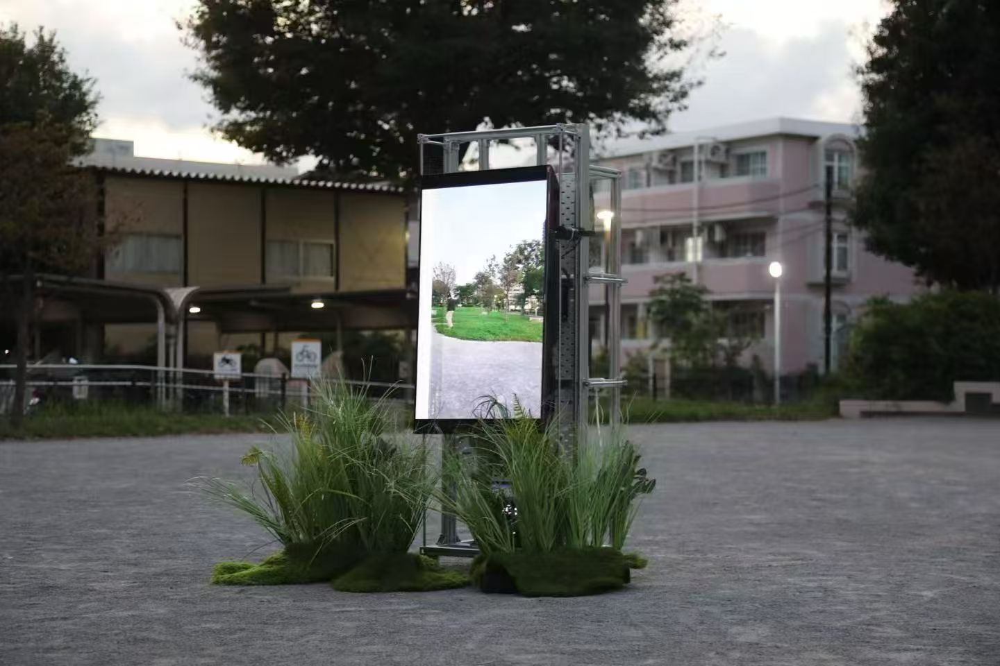

# Michikusa  
**Everyone Becomes Weeds — An Invisible Camera Installation**

Michikusa is an experimental media-art installation that transforms people in front of a camera into “weeds” (道草 / michikusa).  
Using real-time computer vision and generative image processing, the system removes human figures from the scene and replaces them with plants, turning ordinary public space into a quiet, post-human landscape.

This repository contains the core prototype code and visual documentation of the installation model.

---

## Concept

In Japanese, **道草 (michikusa)** means “weeds growing by the roadside,” but also “wandering off the path.”

This project asks:

> What happens when the human subject disappears from the image,  
> and only the overlooked landscape remains?

Rather than recognizing people, the camera **refuses recognition**.  
It erases the human figure and lets plants take their place.

This is not a surveillance camera.  
It is an **anti-recognition camera**.

---

## Installation Model

The system uses:

- YOLOv8 Segmentation for human detection  
- Real-time masking and replacement  
- Plant image synthesis  
- Audio-visual feedback  

When a person enters the frame:

1. The system detects the human body  
2. The human is removed from the image  
3. Plants grow into the empty space  
4. The person becomes “michikusa”  

---

## Visual Documentation

### Installation Overview

---

### Invisible Camera Effect

---

### Replacement Result

---

### Plant Growth Visualization

---

### Leaf Asset

---

## Repository Contents

| File | Description |
|-----|------------|
| `plant_replace_voice_jp.py` | Core program for real-time detection and plant replacement |
| `yolov8n-seg.pt` | Pre-trained YOLOv8 segmentation model |
| `image.png` | Installation overview |
| `71bde1797b57732644b9bc684e9dcebd.jpg` | Invisible camera effect |
| `f3574f97e85ae9c1ba40b60c6dcc619e.jpg` | Replacement result |
| `fb2c7aa96fc1e1049b2c423c2a59dd77.jpg` | Plant growth visualization |
| `leave.png` | Plant texture asset |

---

## Why This Matters

Photography and computer vision have always been tools of **recognition, control, and identity**.

Michikusa proposes another path:

- No face recognition  
- No identity  
- No subject  
- Only landscape  

This is a camera that chooses **not to see humans**.

---

## Author

**Qinyuan Zhou (周沁园)**  
Artist / Researcher  
Tokyo, Japan  

Website: https://www.zhouqinyuan.com  
